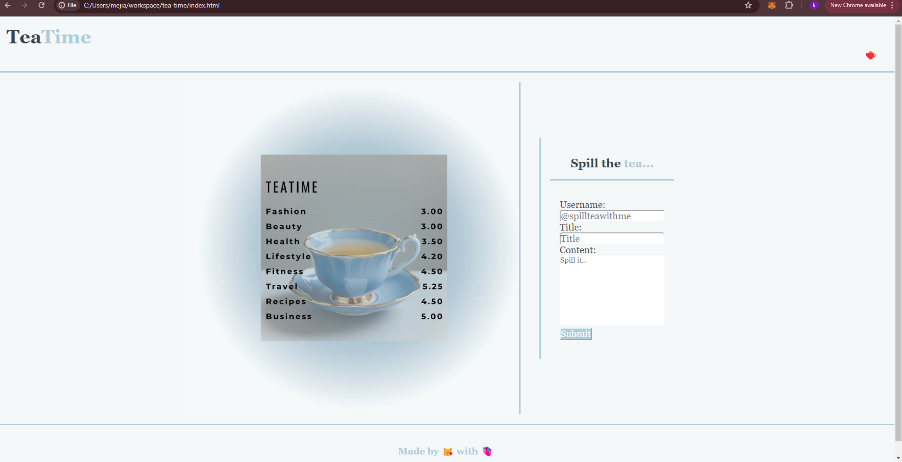
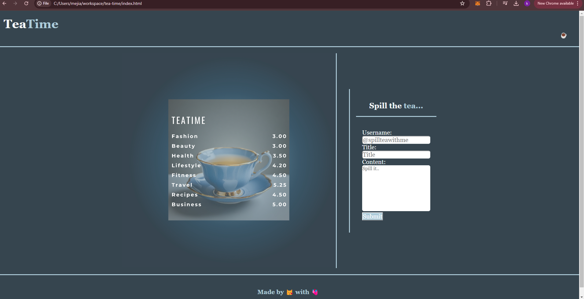
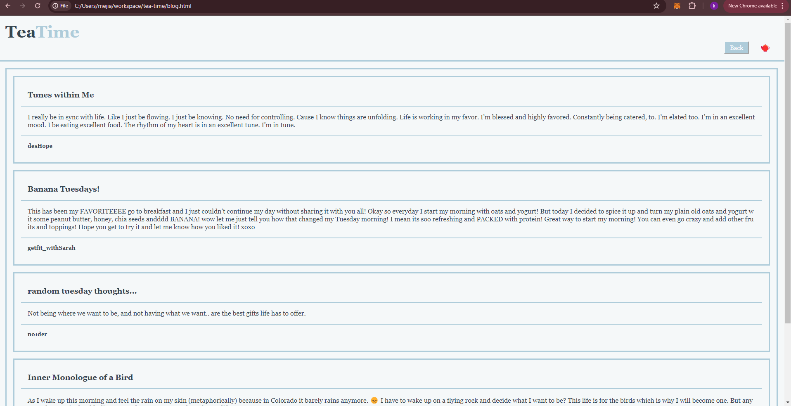
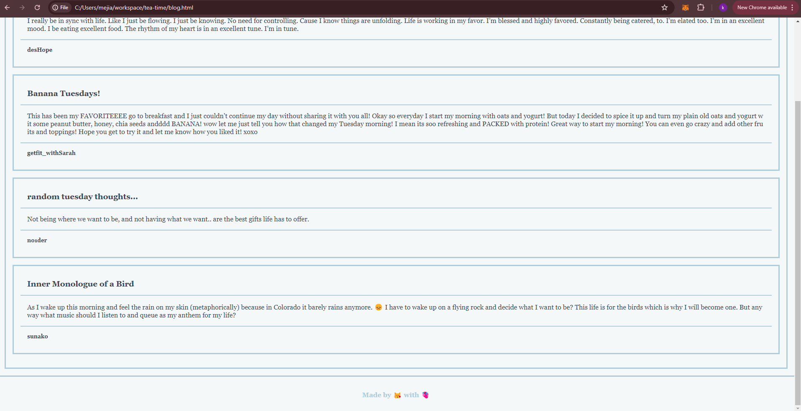
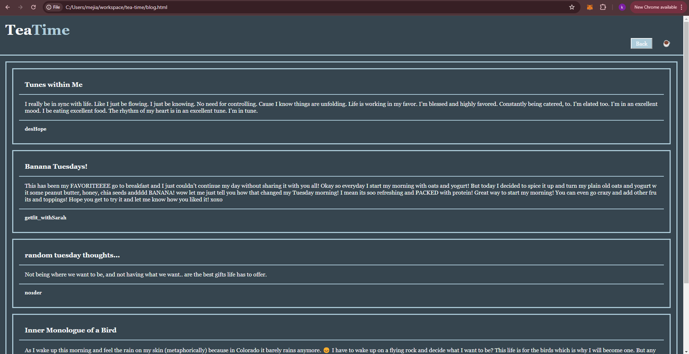
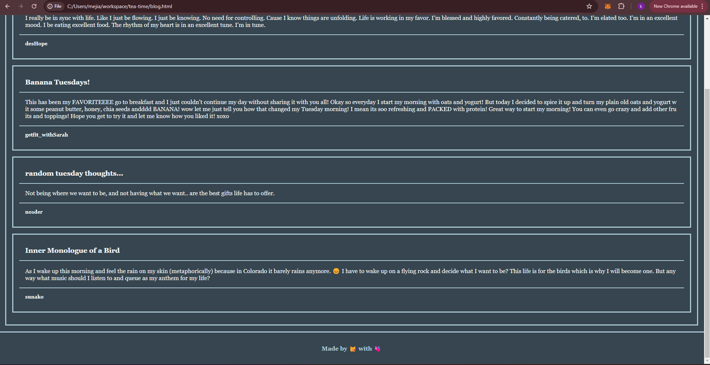

# TeaTime Challenge 4

# Description
For Challenge 4 I was asked to create a Blog Website from scratch.

I created a two-page website where a user can input and view blog posts with a light and dark mode toggle, where user can set the mood to how they are currently feeling.

My inspiration of the aesthetic of the web design is early 2000's blog and sipping tea with friends at the table and sharing thoughts, ideas and inspiration!!! Hence why I decided to name this blog TeaTime! What better way to share your daily thoughts than to share them with some tea on the side?!

# Layout
In this blog website we have two pages:

Landing Page
Blog Timeline

# Landing Page
On the landing page we have a cute and warm welcoming image of a blue tea cup with a cute cafe shop like menu giving the user topics on what they can blog about. 

Right next to it is a form where the user inputs their desired username, title of their blog and of course the blog's content!

On the top right there is a cute kettle icon '🫖' where user can toggle the light/dark mode 

🫖= Dark
☕= Light

# Blog Timeline
On the blog timeline it displays to the user the most recent blog post along with other blogs for them to explore!

On the top right we have 'Back' button that redirects them to the Landing page where they can inpit more blog enteries.

And ofcourse right next to the 'Back' button is the kettle icon that allows user to toggle the light/dark mode.

# Screenshots
LANDING PAGE

BLOG TIMELINE

In screenshots you can see how the weblooks when in light/dark mode.

## SPECIAL Credit
below are credits to my sisters and my best friends who joined in on the fun and tested out my website by creating their own blog post as seen on attached screenshots above:

Tunes within Me
By my best friend, Destiny Hope known as desHope

Banana Tuesdays!
By my sister, Ashley Mejia known as user getfit_withSarah

random tuesday thoughts...
By my sister, Keymi Bruno known as user no1der

Inner Monologue of a Bird
By best friend, Gabrielle Brewer known as user sunako

# Repository Links
https://mejiak7.github.io/tea-time/
https://github.com/mejiak7/tea-time.git